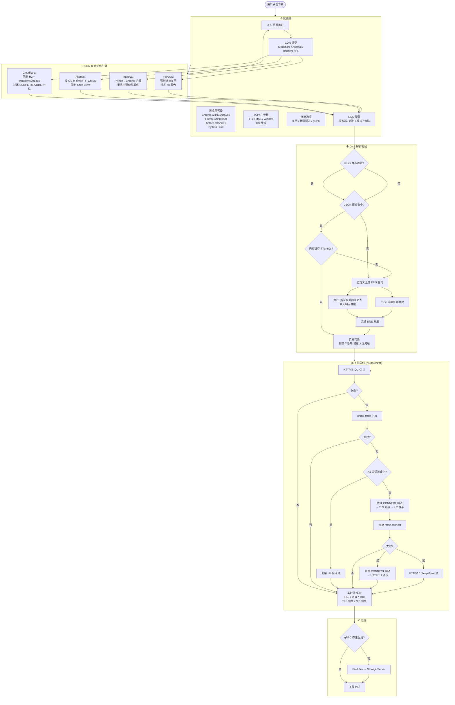
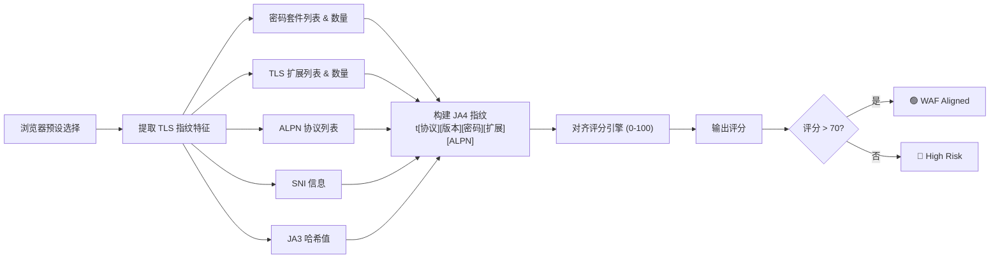
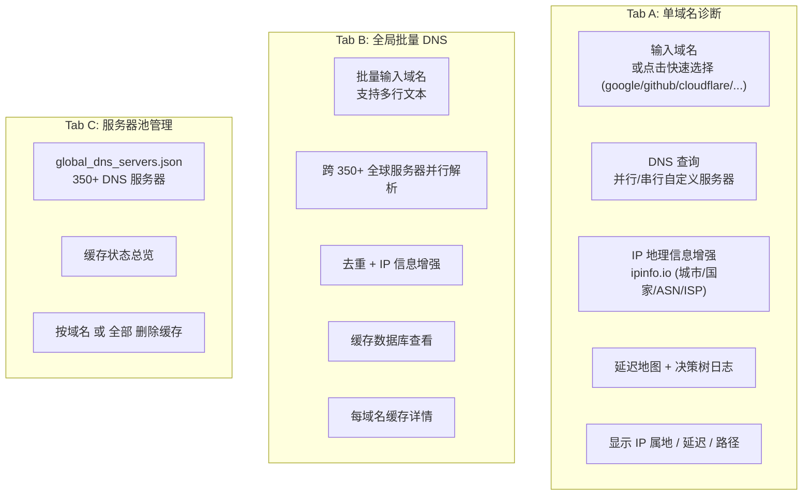
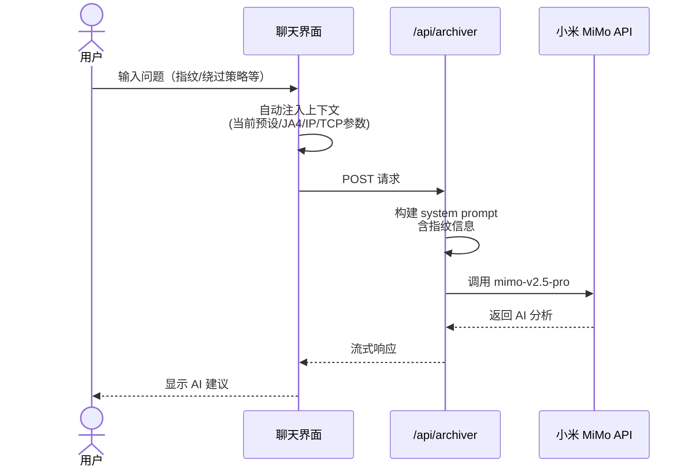
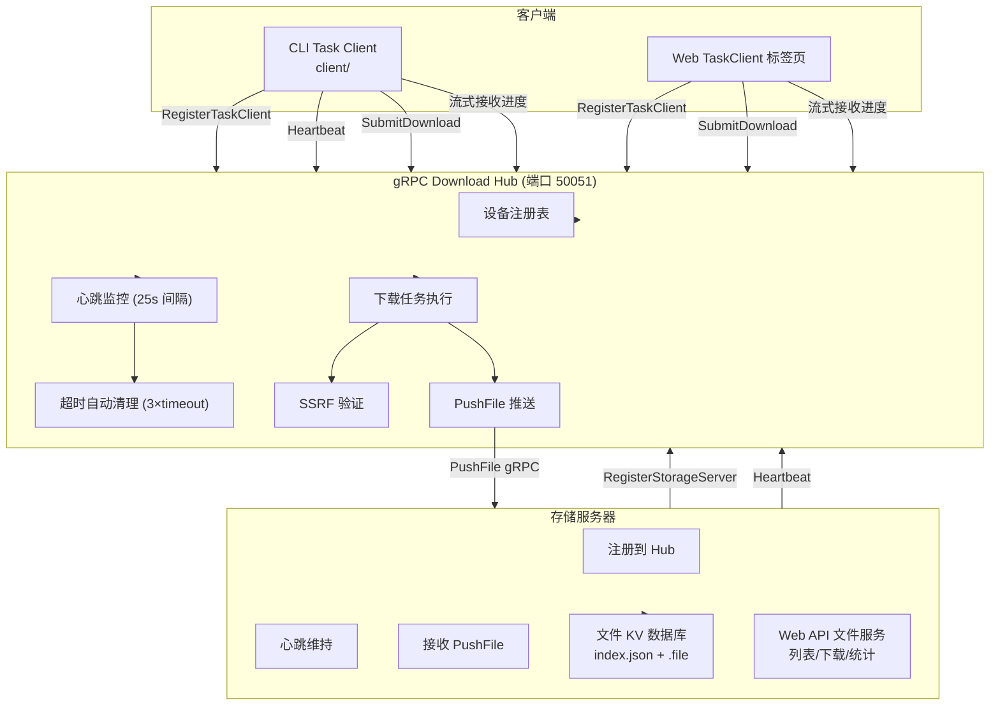
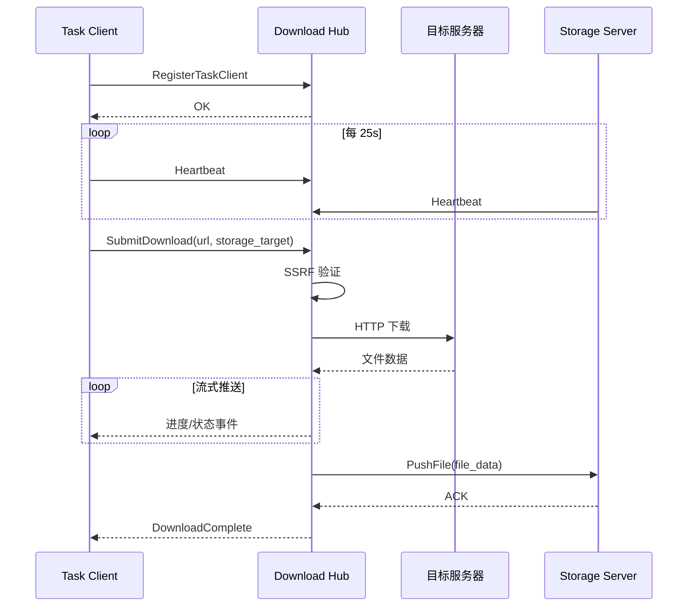
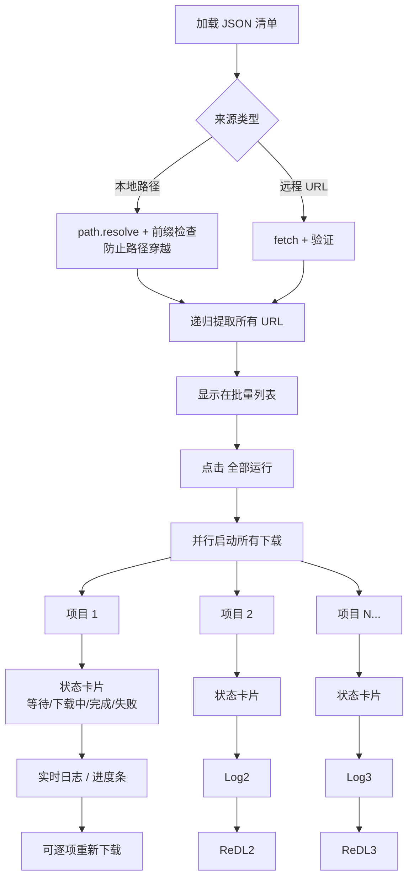
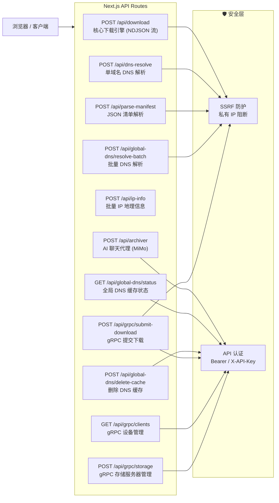
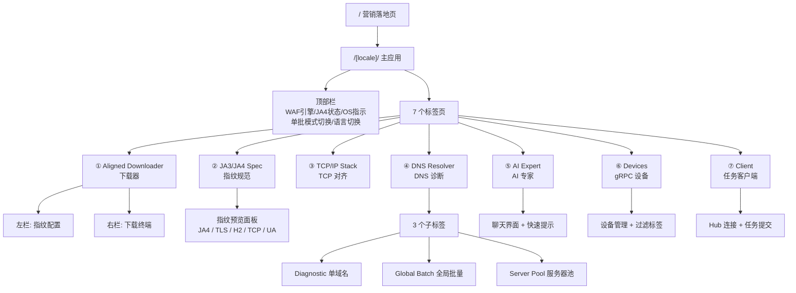

# 完整工作流图

> uTLS/TCP Fingerprint Alignment Downloader v1.0.7

---

## 1. 核心下载工作流

---

## 2. JA3/JA4 指纹分析工作流

---

## 3. DNS 诊断工作流

---

## 4. AI 专家聊天工作流

---

## 5. gRPC 分布式工作流

---

## 6. 批量下载工作流

---

## 7. API 路由总览

---

## 8. 用户界面导航结构

